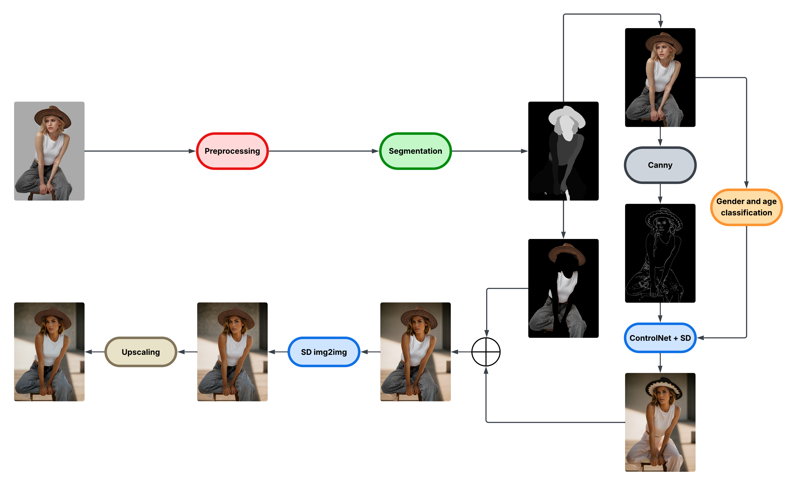
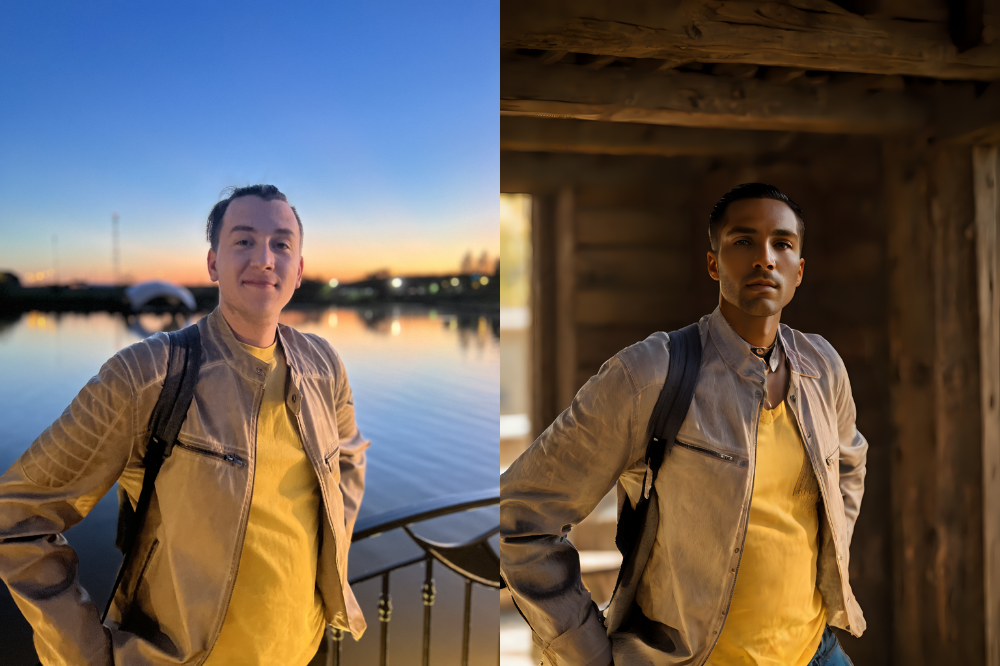
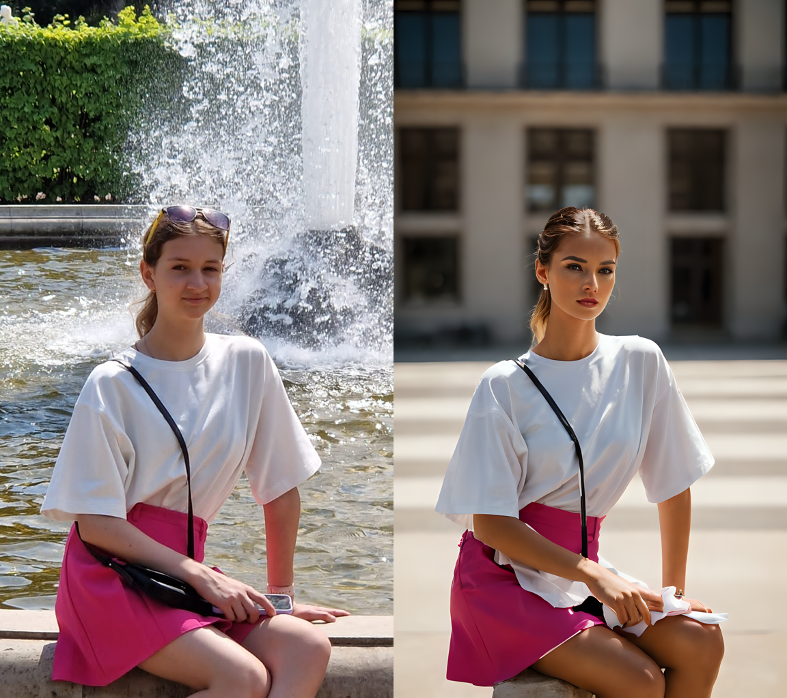

# Improving-Image-Quality-model



Example 1             |  Example 2
:-------------------------:|:-------------------------:
 |  

Это модель для улучшения качества и привлекательности людей в конкретной одежде, посредством генерации нового изображения в высоком разрешении с новым человеком и задним фоном, но находящимся в той же позиции и одежде, что и человек на изначальном изображении. Для самостоятельного запуска и использования модели можно воспользоваться python-ноутбуком (понадобится GPU), либо, если нужен только конечный результат, можно использовать телеграм-бота - @ImageQualityImprovement_bot

### Improving_image_quality_model.ipynb
Чтобы запустить модель в ноутбуке, потребуется GPU

В строчке
```
path_to_the_image = "<YOUR PATH or IMAGE URL>"
```
можно указать путь до изображения, если он имеется локально, либо url
